# Games

## 007 The World is not Enough
### slus-01272
[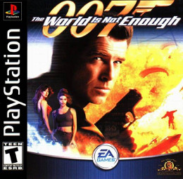](https://github.com/9r3i/psx/releases/tag/slus-01272)

## Mission Impossible
### slus-01016
[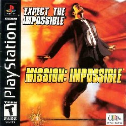](https://github.com/9r3i/psx/releases/tag/slus-01016)

## Spyro The Dragon
### scus-94228
[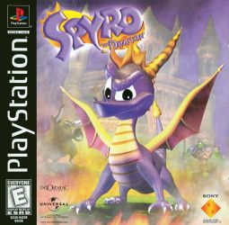](https://github.com/9r3i/psx/releases/tag/scus-94228)

## Resident Evil
### slus-00170

## Need For Speed 2
### slus-00276
[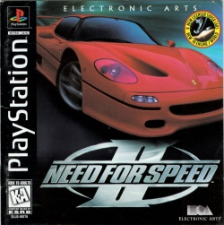](https://github.com/9r3i/psx/releases/tag/slus-00276)

## Metal Slug X
### slus-01212
[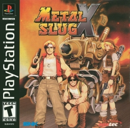](https://github.com/9r3i/psx/releases/tag/slus-01212)

## Harry Potter & The Sorcerer's Stone
### slus-01415
[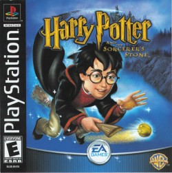](https://github.com/9r3i/psx/releases/tag/slus-01415)

## Monster Rancher
### slus-00568
[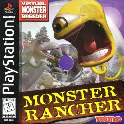](https://github.com/9r3i/psx/releases/tag/slus-00568)

## Moto Racer 2
### slus-00738
[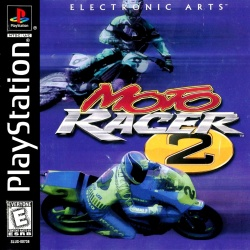](https://github.com/9r3i/psx/releases/tag/slus-00738)

## Driver - You're the wheelman
### slus-00842
[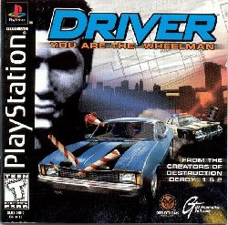](https://github.com/9r3i/psx/releases/tag/slus-00842)

## Spec Ops - Airborne Commando
### slus-01447
[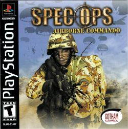](https://github.com/9r3i/psx/releases/tag/slus-01447)

## Crash Team Racing
### scus-94426
[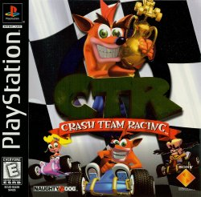](https://github.com/9r3i/psx/releases/tag/scus-94426)

## World Soccer Winning Eleven 2002
### slpm-87056
[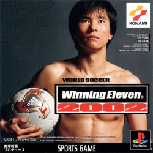](https://github.com/9r3i/psx/releases/tag/slpm-87056)

## Dragon Ball GT Final Bout
### slus-00493
[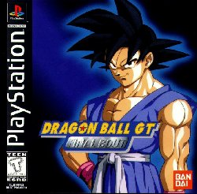](https://github.com/9r3i/psx/releases/tag/slus-00493)

## Dino Crisis 2
### slus-01279
[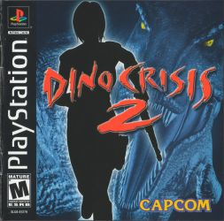](https://github.com/9r3i/psx/releases/tag/slus-01279)

## Gameshark
### slus-99999

## Naruto - Shinobi no Sato no Jintori Kassen
### slps-03553
[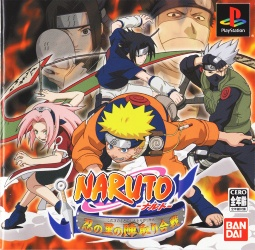](https://github.com/9r3i/psx/releases/tag/slps-03553)

## Harvest Moon - Back to Nature
### slus-01115
[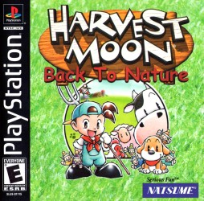](https://github.com/9r3i/psx/releases/tag/slus-01115)

## FIFA Soccer 2005
### slus-01585

## Silent Hill
### slus-00707
[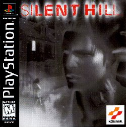](https://github.com/9r3i/psx/releases/tag/slus-00707)

## 
### slus-0

## 
### slus-0

## 
### slus-0

